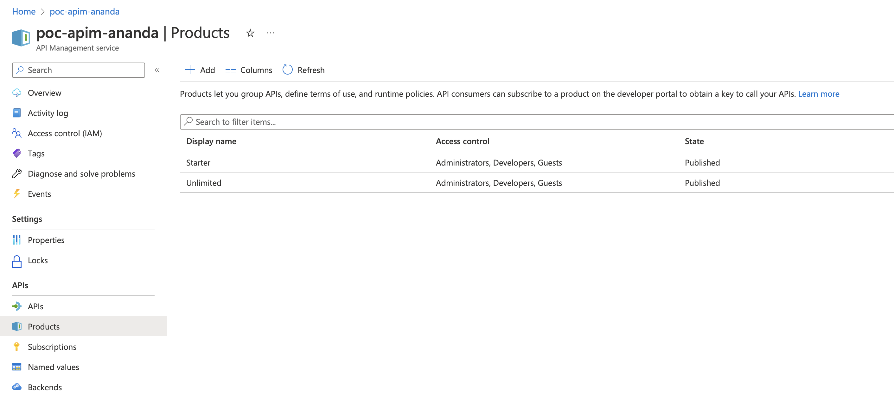
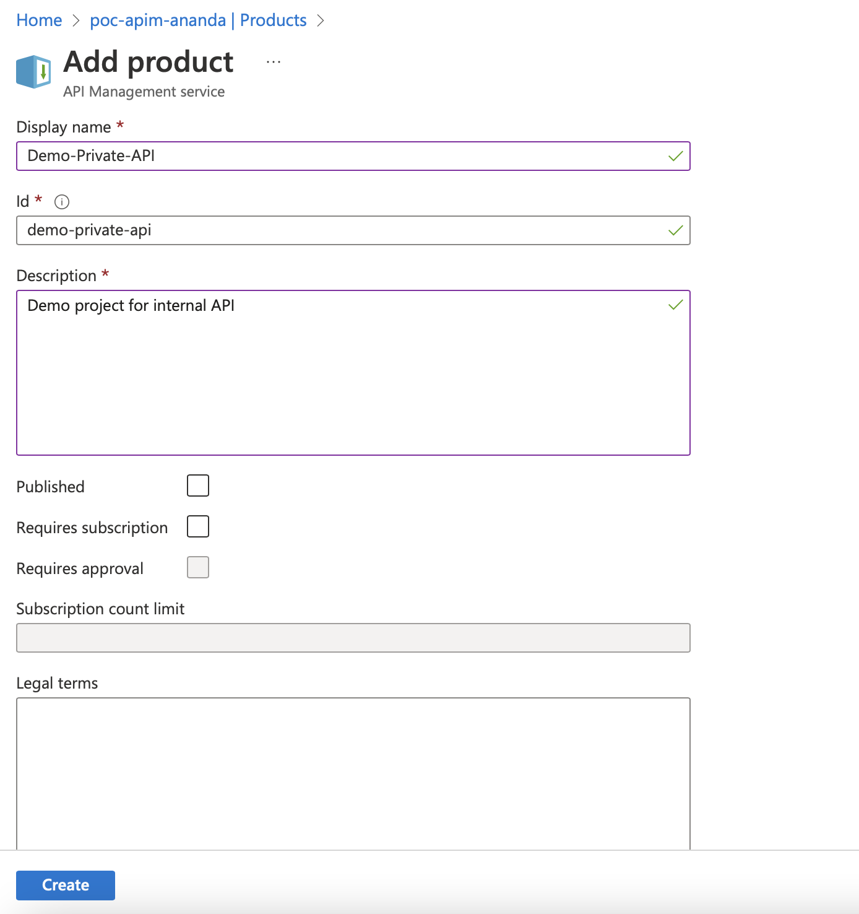
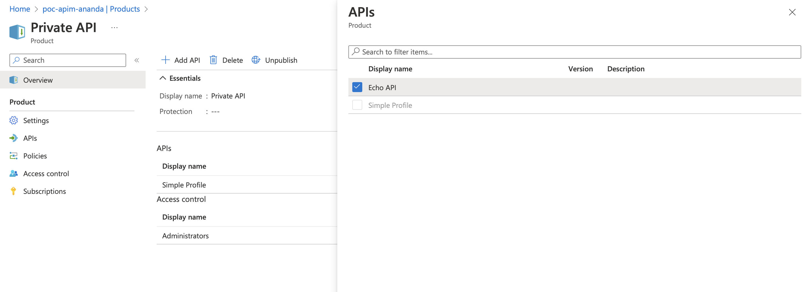

# Azure API Management 
# Product Provision

## Introduction
Product is a collection of APIs which can be published 

## Add/Create products

 
1. Login to console and navigate to the API management instance that already created (from previous topics)
2. Select `Products` from menu plane (left-hand side)
3. Click `+ Add` to create the new API `Product`
4. Fill in API product detail 

 

 

- Name (name of product)
- ID (this value will be auto generated from name, but can be adjusted)
- Description
- Publish (Leave unchecked for this stage)
- Requires Subscription (Leave unchecked for this stage)
- Requires Approval (Leave it unchecked)
- Legal term (Optional)
- APIs (Leave it as default for this stage)
5. Click `Create` for creating the APIs `Products`

## Add API(s) to Product
Before add APIs to Product, you must have APIs created (or import) to Azure API Management instance first. (assume that this step is done in the previous topics)

1. Login to console and navigate to your API management instance, Product and select the product that you want to add APIs to
2. Select `Products` from menu plane (left-hand side)
3. Select `APIs` from the menu plane and then click `+ Add` to add APIs to Product
3. Select APIs from the list and then click `Select` to add APIs to Product

 

 
 

## Configure Subscription

## Test consume private API(s) using subscription keys

