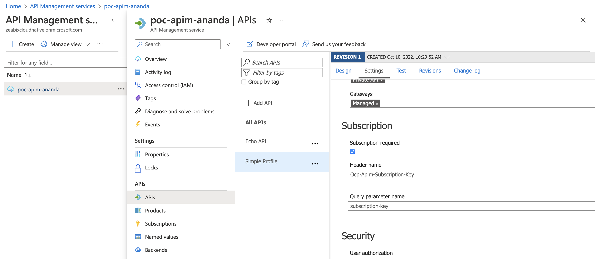

# Azure API Management 
# Product Provision

## Introduction
Product is a collection of APIs which can be published 


## Add/Create products


<br/>
1. Login to console and navigate to the API management instance that already created (from previous topics)
2. Select `Products` from menu plane (left-hand side)
3. Click `+ Add` to create the new API `Product`
4. Fill in API product detail 

<br/>


<br/>

- Name (name of product)
- ID (this value will be auto generated from name, but can be adjusted)
- Description
- Publish (Leave unchecked for this stage)
- Requires Subscription (Leave unchecked for this stage)
- Requires Approval (Leave it unchecked)
- Legal term (Optional)
- APIs (Leave it as default for this stage)
5. Click `Create` for creating the APIs `Products`


## Add API(s) to Product
Before add APIs to Product, you must have APIs created (or import) to Azure API Management instance first. (assume that this step is done in the previous topics)


1. Login to console and navigate to your API management instance, Product and select the product that you want to add APIs to
2. Select `Products` from menu plane (left-hand side)
3. Select `APIs` from the menu plane and then click `+ Add` to add APIs to Product
3. Select APIs from the list and then click `Select` to add APIs to Product

<br/>


<br/>
<br/>


## Configure Subscription
In the previous steps, we have created and configured Product with desired APIs. However, those API can be publicly access without any access control.

This section we will improve the security by configure Product to require `subscription` this technique can be use to control the access to product which we require it to be private APIs. Or can be used to allow some specific set of clients that can be access to this product.

In order to make APIs/Product requires subscription (to increase security), Need to configure both APIs level and Product level. (According to Azure official document)

```
When API Management receives an API request from a client without a subscription key, it handles the request according to these rules:

Check first for the existence of a product that includes the API but doesn't require a subscription (an open product). If the open product exists, handle the request in the context of the APIs, policies, and access rules configured for the product.
If an open product including the API isn't found, check whether the API requires a subscription. If a subscription isn't required, handle the request in the context of that API and operation.
If no configured product or API is found, then access is denied.
```

[Reference](https://learn.microsoft.com/en-us/azure/api-management/api-management-subscriptions)

<br/>
Before we start to configure the subscription, let test invoking APIs that haven't had the subscription required configured (for comparison later)

<br/>

1. Login to Azure portal and navigate to your target APIs (in Azure API management)
2. Get `Base URL`  from tab `Settings`
3. Use `curl` or any HTTP Clients, e.g. Postman

*Example*
```sh
$ curl -XGET https://poc-apim-ananda.azure-api.net/api/profiles/
```

4. It should get the response without any error (HTTP 200)
*Example*
```json
[{"createdAt":"2022-09-29T20:35:11.769Z","name":"Ora Cummings DDS","avatar":"https://cloudflare-ipfs.com/ipfs/Qmd3W5DuhgHirLHGVixi6V76LhCkZUz6pnFt5AJBiyvHye/avatar/493.jpg","email":"Keven78@gmail.com","platinum_tier":true,"id":"1"},{"createdAt":"2022-09-29T11:06:15.196Z","name":"Claire Beier","avatar":"https://cloudflare-ipfs.com/ipfs/Qmd3W5DuhgHirLHGVixi6V76LhCkZUz6pnFt5AJBiyvHye/avatar/429.jpg","email":"Eulah.Upton@gmail.com","platinum_tier":false,"id":"2"},{"createdAt":"2022-09-29T13:52:37.302Z","name":"Mrs. Kenneth Zulauf","avatar":"https://cloudflare-ipfs.com/ipfs/Qmd3W5DuhgHirLHGVixi6V76LhCkZUz6pnFt5AJBiyvHye/avatar/201.jpg","email":"Van_Zieme32@hotmail.com","platinum_tier":true,"id":"3"},{"createdAt":"2022-09-30T01:14:57.827Z","name":"Raymond Harris","avatar":"https://cloudflare-ipfs.com/ipfs/Qmd3W5DuhgHirLHGVixi6V76LhCkZUz6pnFt5AJBiyvHye/avatar/611.jpg","email":"Mack90@yahoo.com","platinum_tier":false,"id":"4"},{"createdAt":"2022-09-29T22:24:05.088Z","name":"Vernon Kuvalis","avatar":"https://cloudflare-ipfs.com/ipfs/Qmd3W5DuhgHirLHGVixi6V76LhCkZUz6pnFt5AJBiyvHye/avatar/800.jpg","email":"Morris.Carroll8@hotmail.com","platinum_tier":false,"id":"5"},{"createdAt":"2022-09-29T21:08:13.944Z","name":"Ashley Franey","avatar":"https://cloudflare-ipfs.com/ipfs/Qmd3W5DuhgHirLHGVixi6V76LhCkZUz6pnFt5AJBiyvHye/avatar/572.jpg","email":"Jamaal.Feest0@hotmail.com","platinum_tier":false,"id":"6"},{"createdAt":"2022-09-29T21:08:03.173Z","name":"Marie Deckow","avatar":"https://cloudflare-ipfs.com/ipfs/Qmd3W5DuhgHirLHGVixi6V76LhCkZUz6pnFt5AJBiyvHye/avatar/194.jpg","email":"Salvatore91@hotmail.com","platinum_tier":false,"id":"7"},{"createdAt":"2022-09-30T05:23:30.456Z","name":"Jeanette McCullough","avatar":"https://cloudflare-ipfs.com/ipfs/Qmd3W5DuhgHirLHGVixi6V76LhCkZUz6pnFt5AJBiyvHye/avatar/661.jpg","email":"Filomena.Wunsch@hotmail.com","platinum_tier":false,"id":"8"},{"createdAt":"2022-09-29T13:20:26.187Z","name":"Antoinette Bergnaum III","avatar":"https://cloudflare-ipfs.com/ipfs/Qmd3W5DuhgHirLHGVixi6V76LhCkZUz6pnFt5AJBiyvHye/avatar/851.jpg","email":"Naomie.Spencer@hotmail.com","platinum_tier":false,"id":"9"},{"createdAt":"2022-09-30T06:13:27.437Z","name":"Sergio Rempel","avatar":"https://cloudflare-ipfs.com/ipfs/Qmd3W5DuhgHirLHGVixi6V76LhCkZUz6pnFt5AJBiyvHye/avatar/177.jpg","email":"Gilda87@hotmail.com","platinum_tier":true,"id":"10"}]
```

### Enabled Subscription requirement (APIs)
1. Login to console and navigate to your target product in the Azure API Management
2. On the `Settings` tab, Section `Subscription`, click checkbox `Subscription Requires`
3. Click `Save` to save changes
<br/>



<br/>

### Enabled Subscription requirement (Products)
1. Login to console and navigate to your target APIs in the Azure API Management

2. Enable subscription by click checked the `Requires Subscription`

3. Click `Save` to apply the change

4. Go back to HTTP Client tools that we used earlier and test it again, we should see the error return (since we haven't supplied the subscription key yet)
<br/>

*Example*
```sh
$ curl -XGET https://poc-apim-ananda.azure-api.net/api/profiles/        
{ "statusCode": 401, "message": "Access denied due to missing subscription key. Make sure to include subscription key when making requests to an API." }
```

<br/>
<br/>

## Test consume private API(s) using subscription keys

From the previous section, we have tried to invoked protected APIs/Product by calling API directly without supplying subscription key. In this section we will walkthrough how to create subscription for APIs/Product and how to use it.

1. Login to Azure Portal and navigate to your Azure API Management

2. Click `Subscriptions` -> `+ Add Subscription`

3. Fill the subscription details

- Name
- Display Name (Optional, but please provide for good practices reason)
- Scope: Product
- Product: Select your product
- User: <skip>

4. Then click `Create`


<br/>

5. Getting the subscription key, by click `...` icon at the end of the subscription that you've just created and click `Show/Hide keys` then copy the `Primary Key`


<br/>

Now, we have subscription key, this key will use for authentication. The subscription key can be supplied when request the APIs by the http header or query string. Next we will check the specification for http header or query string

6. Login to Azure Portal and navigate the your API management, APIs then click on `Settings` tab. Scroll down to section `Subscription`. Copy the `Header name` to be used in the next step. The default value is `Ocp-Apim-Subscription-Key` but it can be changed to fit your requirement

7. Using `curl` or any prefer HTTP client tool, e.g. Postman, etc. to send the request to APIM again with HTTP header that we got from step#6 along with the subscription key that we got from step#5
```sh
$ curl -XGET https://poc-apim-ananda.azure-api.net/api/profiles/ -H 'Ocp-Apim-Subscription-Key: b2e41a40c4d64d8786c93b46e4841fcb' 
```

8. Check the result, you should be able to call the API without any HTTP40x error


## Increse security by add ip-filtering

Besides using `Subscription` features to control the access to the APIs, Azure API Management also provide IP filtering capability to allow API publisher to configure whitelist and blacklist IPs for each API. In this topic we will walk through how to implement IP filtering to protect the APIs

1. Login to Azure Portal and navigate to your API Management instance
2. Click menu `APIs`, then Select your target API that will implement the IP filtering
3. On the `Design` tab, `Inbound Processing`, click `Add Policy`

<br/>


<br/>

4. Select `Filter IP addresses`

<br/>


<br/>

5. We will configured the `Allowed IPs`, click `Add IP filter` and enter `10.10.10.0` for `IP ADDRESS FROM` and `10.10.10.128` for `IP ADDRESS TO`, and then click `Save`

<br/>


<br/>

6. Test invoke the API using `curl` or HTTP Client tool again, you should see error `Forbidden`

```json
{ "statusCode": 403, "message": "Forbidden" }
```

The reason that it failed because our IP is not in the range `10.10.10.0 - 10.10.10.128`. This mechanism can be used to limit the access from client.

7. Go to `https://whatismyipaddress.com/` and get your public IP address

8. Reconfigure the ip range to cover your public IP
9. Rerun the test from step#6 again, this time you should see the success result 

### Recommended Further exercise

Besides configuring IP whitelist from the exercise above, The IP Filtering can be configure using IP blacklist machanisum. Recommend to explore it using blacklist capability 